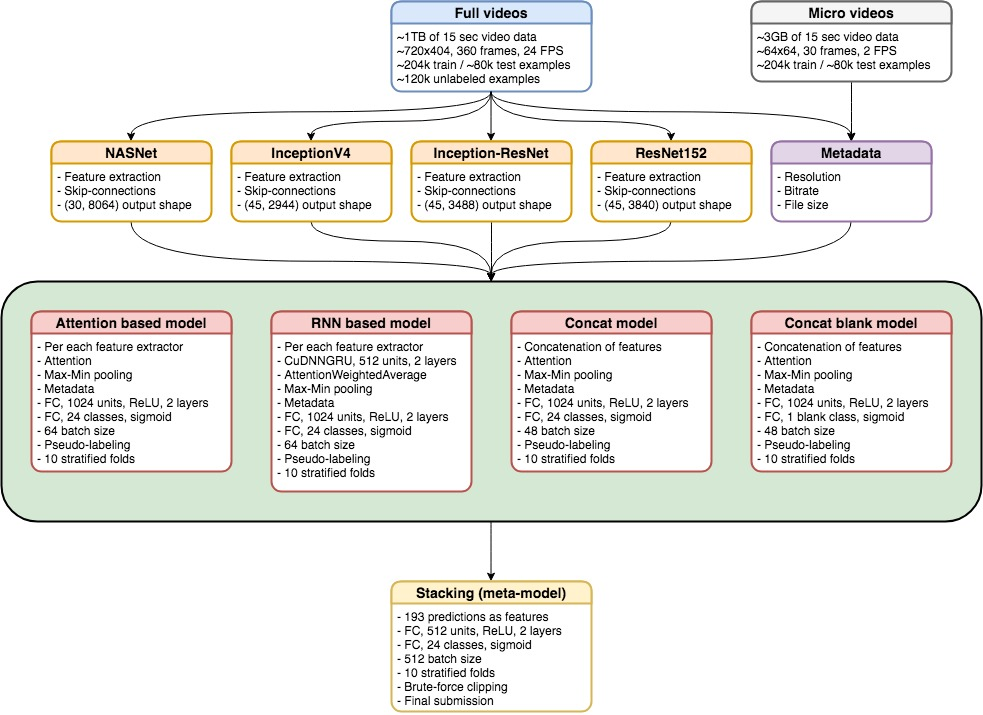
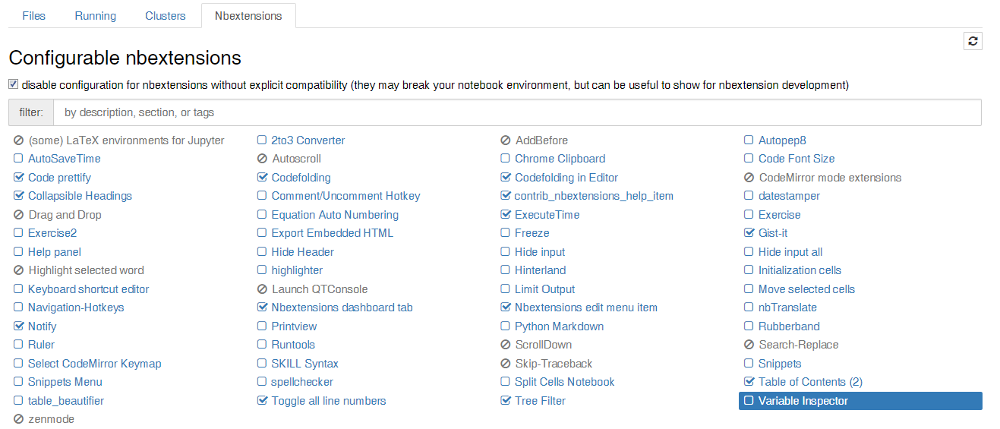

Jungle video trap challenge solution by AVeysov and SKolbachev
==============================
- Blog posts explaining the solution part [one](spark-in.me/post/jungle-animal-trap-competition-part-one), part [two](spark-in.me/post/jungle-animal-trap-competition-part-two);
- Classifying animals using jungle trap videos (200k+, 1TB) with 90%+ accuracy with CNNs;
- Also visit out [blog](https://spark-in.me/tag/group-data-science) and [channel](https://t.me/snakers4) (seriously!);

To replicate our final result from [here](https://www.drivendata.org/competitions/49/deep-learning-camera-trap-animals/leaderboard/) you need more or less to follow these steps:

1. Download the dataset from [here](https://www.drivendata.org/competitions/49/deep-learning-camera-trap-animals/) - (see some hints below);
2. Build the environment via the below Dockerfile;
3. Extract the features and metadata from the videos;
4. Run the final models;

Architecture
------------



Project Organization
------------

    ├── LICENSE
    ├── README.md           <- The top-level README for developers using this project.
    ├── data
    │   ├── interim         <- Extracted features and metadata
    │   ├── micro           <- The original micro dataset (64x64 videos)
    │   └── raw             <- The original unpacked 1TB raw full size video dataset
    │
    ├── models              <- Trained and serialized models, model predictions, or model summaries
    │   ├── blend           <- Trained stacking models
    │   └── predictions     <- Models predictions in *.npy and *.csv formats
    │
    ├── notebooks           <- Jupyter notebooks (provided just fyi for completeness)
    │
    ├── Dockerfile          <- The Dockerfile to build the environment
    │
    ├── src                 <- Source code for use in this project.
    │   ├── extract_features    <- Extracts CNN features
    │   ├── extract_meta_data   <- Extracts video meta-data
    │   └── train_models        <- Scripts for training models
    │
    └── test_environment.py <- A set of small scripts to test the environment

Downloading data
------------

Download and unpack the following datasets to their respective folders from [here](https://www.drivendata.org/competitions/49/deep-learning-camera-trap-animals/data/):
- data/raw - the full 1TB dataset
- data/micro - micro dataset

Download the annotation files and micro dataset using the below jupyter notebook snippet:

```
import collections

file_dict = collections.OrderedDict()
file_dict['data/submission.csv'] = 'https://s3.amazonaws.com/drivendata/data/49/public/submission_format.csv'
file_dict['data/train.csv'] = 'https://s3.amazonaws.com/drivendata/data/49/public/train_labels.csv'
file_dict['data/micro/micro_chimps.tgz'] = 'https://s3.amazonaws.com/drivendata-public-assets/micro_chimps.tgz'

for file,url in file_dict.items():
    url_q = "'" + url + "'"
    ! wget --continue --no-check-certificate --no-proxy -O $file $url_q

```

For the full dataset you will have to be more creative, I recommend using [this](https://help.ubuntu.com/community/TransmissionHowTo).

Setting up the environment
------------

Key dependencies:
- Ubuntu 16.04;
- CUDA + CUDNN + Nvidia GPU;
- Docker and nvidia-docker;
- This pre-trained model [zoo](https://github.com/Cadene/pretrained-models.pytorch);

Make sure that you are familiar with Docker and building docker images from Dockerfiles and [nvidia-docker](https://github.com/NVIDIA/nvidia-docker).

Use the provided Dockerfile to build an environment.
Change the **ENTER_YOUR_PASS_HERE** placeholder to the desired root password (is necessary if you want to ssh remotely into the container).

The following libraries should be installed manually by logging into the container:
- ```pip3 install moviepy```
- ```pip3 install git+https://github.com/aleju/imgaug```
- ```pip3 install sk-video```
- ```pip3 install joblib```

If you are not familiar with Docker, consider following / reading these materials:
- [Docker](https://towardsdatascience.com/how-docker-can-help-you-become-a-more-effective-data-scientist-7fc048ef91d5) for data science;
- A series of posts on our channel with useful links [1](https://t.me/snakers4/1476) [2](https://t.me/snakers4/1479) (if you do not speak Russian - just follow links - they ultimately link to Enlish articles mostly);

**Warning**
On some machines jupyter extenstions give me hell during installation, or they just do no work.
Alternative ways of intallation

```
# A NOTE ON ENABLING JPN EXTENSIONS
# sometimes pip install does not work on some systems
# installation from source solves the problem
git clone https://github.com/ipython-contrib/jupyter_contrib_nbextensions.git
pip install -e jupyter_contrib_nbextensions
jupyter contrib nbextension install --system

# or install via pip from repository
pip install git+https://github.com/ipython-contrib/jupyter_contrib_nbextensions
jupyter contrib nbextension install --system
```


Running the environment
------------

1. Build the container;
2. Make sure you have all the necessary ports exposed (i.e. 8888 for jupyter and 6006 for tensorboard);
3. Use the below commands to run the container;
4. Use ```docker exec -it --user root CONTAINER_ID /bin/bash``` to ssh into docker locally;
5. You may also add ssh port pass-though (into EXPOSE statement and into docker run) and ssh into container remotely. Also you may change password auth to ssh-key;

For nvidia-docker use:

```
nvidia-docker run -it -v /PATH/TO/YOUR/FOLDER:/home/keras/notebook -p 8888:8888 -p 6006:6006 --shm-size 8G YOUR_DOCKER_IMAGE_NAME --runtime=nvidia 
```

For nvidia-docker 2 use:

```
docker run --runtime=nvidia -e NVIDIA_VISIBLE_DEVICES=all -it -v /PATH/TO/YOUR/FOLDER:/home/keras/notebook -p 8888:8888 -p 6006:6006 --shm-size 8G YOUR_DOCKER_IMAGE_NAME    
```

Note that without ```--shm-size``` Pytorch data loaders will not work.

Testing the environment
------------

1. Run test_environment.py - and make sure it works;
2. The only key major change that occured recently is Pytorch 0.3 being released, but this should not cause any issues - but be cautious;
3. Not all keras + tf versions are friednly with each other - run at least one test from [here](https://github.com/nerox8664/pytorch2keras) to make sure error is low;


Extracting features and meta-data
------------

You may consider fine-tuning the encoders (which performed strangely on validation for us - and therefore we failed to utilize them fully) or building end2end pipeline (which we also did), but the easiest and fastest way is to 
- extract features
- use them as inputs to meta-model

Run the following scripts sequentially. Note that on 2 Nvidia 1080 Ti GPUs each feature set (train+test) took ~ 1 day to unpack.

- Extract meta-data
```
cd src/extract_meta_data/

python3 extract_meta_data.py
python3 extract_64x64_meta_data.py
```
- Create folders
```
mkdir -p ../../data/interim/inception4_test
mkdir -p ../../data/interim/inception4_train

mkdir -p ../../data/interim/ir_test
mkdir -p ../../data/interim/ir_train

mkdir -p ../../data/interim/nasnet_test
mkdir -p ../../data/interim/nasnet_train

mkdir -p ../../data/interim/resnet_test
mkdir -p ../../data/interim/resnet_train

```
- Extract features via running these python scripts
```
cd src/extract_features/

python3 inception4_extract_test.py
python3 inception4_extract_train.py
python3 inception_resnet_extract_test.py
python3 inception_resnet_extract_train.py
python3 nasnet_extract_test.py
python3 nasnet_extract_train.py
python3 resnet_extract_test.py
python3 resnet_extract_train.py
```


Training the final model 
------------
We trained 9 models, each on 5 stratified folds, using extracted features: 
- 3 RNN models with `AttentionWeightedAverage` and `Max-Min` polling layers based on resnet152, inception-resnet and inception4.
    * NOTE: `Attention` layer from `src/train_models/local_utils.py` could be used instead of `AttentionWeightedAverage` and might provide better score.
```
cd src/train_models/

python3 train_models.py --model_name resnet152_skip_CuDNNGRU512x2_dense1024_dense1024_bs64 --shape 45 3840 --folder $PATH_TO_FEAT --test_folder $PATH_TO_TEST_FEAT -rnn 1 -e 15 -pe 5 -bs 64 -ps_bs 44 -ps_tbs 20
python3 train_models.py --model_name inception4_skip_CuDNNGRU512x2_dense1024_dense1024_bs64 --shape 45 2944 --folder $PATH_TO_FEAT --test_folder $PATH_TO_TEST_FEAT -rnn 1 -e 15 -pe 5 -bs 64 -ps_bs 44 -ps_tbs 20
python3 train_models.py --model_name inception_resnet_skip_CuDNNGRU512x2_dense1024_dense1024_bs64 --shape 45 3488 --folder $PATH_TO_FEAT --test_folder $PATH_TO_TEST_FEAT -rnn 1 -e 15 -pe 5 -bs 64 -ps_bs 44 -ps_tbs 20
```

- 4 models with `Attention` and `Max-Min` pooling layers based on resnet152, inception-resnet, inception4 and nasnet.
```
cd src/train_models/

python3 train_models.py --model_name resnet152_skip_dense1024x2_bs64 --shape 45 3840 --folder $PATH_TO_FEAT --test_folder $PATH_TO_TEST_FEAT -e 15 -pe 5 -bs 64 -ps_bs 44 -ps_tbs 20
python3 train_models.py --model_name inception4_skip_dense1024x2_bs64 --shape 45 2944 --folder $PATH_TO_FEAT --test_folder $PATH_TO_TEST_FEAT -e 15 -pe 5 -bs 64 -ps_bs 44 -ps_tbs 20
python3 train_models.py --model_name inception_resnet_skip_dense1024x2_bs64 --shape 45 3488 --folder $PATH_TO_FEAT --test_folder $PATH_TO_TEST_FEAT -e 15 -pe 5 -bs 64 -ps_bs 44 -ps_tbs 20
python3 train_models.py --model_name nasnet_skip_dense1024x2_bs48 --shape 30 8064 --folder $PATH_TO_FEAT --test_folder $PATH_TO_TEST_FEAT -e 15 -pe 5 -bs 48 -ps_bs 36 -ps_tbs 12
```

- 1 *concat* model with `Attention` and `Max-Min` pooling layers based on *concatenation* of resnet152, inception-resnet, inception4.
    * NOTE: It's reasonable to add more pre-trained features to the model including nasnet. We just didn't have time to do it.
```
cd src/train_models/

python3 train_concat_models.py --model_name concat3_skip_dense1024x2_bs48 --resnet152_folder $PATH_TO_RESNET152 --resnet152_test_folder $PATH_TO_RESNET152_TEST --inception_resnet_folder $PATH_TO_IR --inception_resnet_test_folder $PATH_TO_IR_TEST --inception4_folder $PATH_TO_INCEPTION4 --inception4_test_folder $PATH_TO_INCEPTION4_TEST -e 15 -pe 5 -bs 48 -ps_bs 32 -ps_tbs 16
```

- 1 *concat blank* model with `Attention` and `Max-Min` pooling layers based on *concatenation* of resnet152, inception-resnet, inception4. We got a slightly better score for blan/not blank predictions by training separate model.
```
cd src/train_models/

python3 train_concat_models.py --model_name concat3_blank_skip_dense1024x2_bs48 --resnet152_folder $PATH_TO_RESNET152 --resnet152_test_folder $PATH_TO_RESNET152_TEST --inception_resnet_folder $PATH_TO_IR --inception_resnet_test_folder $PATH_TO_IR_TEST --inception4_folder $PATH_TO_INCEPTION4 --inception4_test_folder $PATH_TO_INCEPTION4_TEST -blank 1 -e 15 -pe 5 -bs 48 -ps_bs 32 -ps_tbs 16
```

We found that 15 training epochs + 5 pseudo-labelling training epochs should be enough to get pretty decent score (you may consider to use more epochs though, especially for big models like *nasnet* and *concat*). We chose batch size 64 (44/20)for single-features models and 48 (32/16) for *nasnet* and *concat* models. Generally, bigger batch size was better. The choice depended on disk I/O and training speed. But you may try to use 128+.
    
Predictions from the models above were stacked together via NN meta-model using 10 stratified folds to get the final score. NOTE: Model names and prediction file names are hardcoded in the `stacking.py` script.
```
cd src/train_models/

python3 stacking.py
```

Supplementary materials 
------------
Provided just fyi, use at your own risk.

---

Notebooks are best opened with the following [extensions](https://github.com/ipython-contrib/jupyter_contrib_nbextensions) enabled:


---


Notebooks:
- jungle.ipynb - data expoloration + various pipelines and experiments
- playing_with_extractors.ipynb - playing with Pytorch feature extractors
- video_loading_benchmark.ipynb - playing with several video processing libraries
